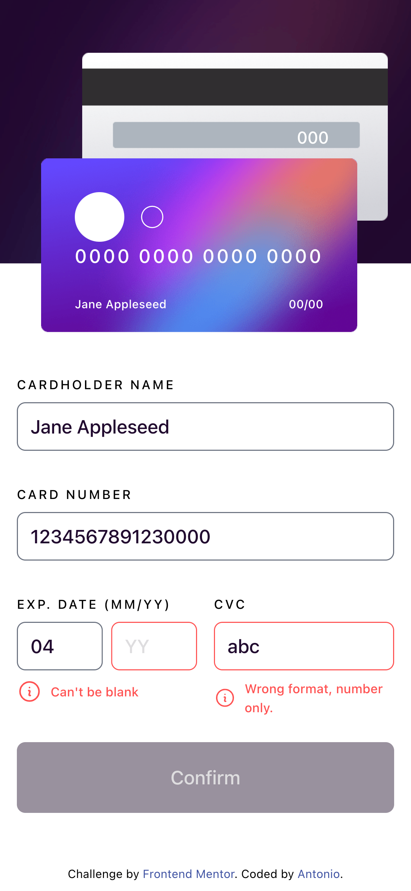
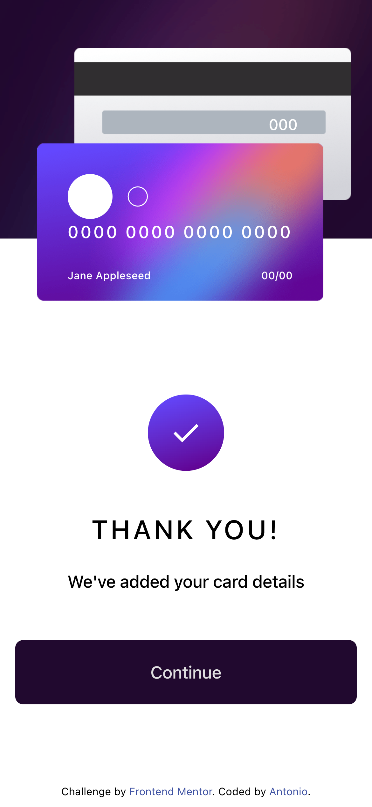

# Frontend Mentor - Interactive card details form solution

This is a solution to the [Interactive card details form challenge on Frontend Mentor](https://www.frontendmentor.io/challenges/interactive-card-details-form-XpS8cKZDWw). Frontend Mentor challenges help you improve your coding skills by building realistic projects.

## Table of contents

- [Overview](#overview)
  - [The challenge](#the-challenge)
  - [Screenshot](#screenshot)
  - [Links](#links)
- [My process](#my-process)
  - [Built with](#built-with)
  - [What I learned](#what-i-learned)
  - [Continued development](#continued-development)
  - [Useful resources](#useful-resources)
- [Author](#author)
- [Acknowledgments](#acknowledgments)

**Note: Delete this note and update the table of contents based on what sections you keep.**

## Overview

### The challenge

Users should be able to:

- Fill in the form and see the card details update in real-time
- Receive error messages when the form is submitted if:
  - Any input field is empty
  - The card number, expiry date, or CVC fields are in the wrong format
- View the optimal layout depending on their device's screen size
- See hover, active, and focus states for interactive elements on the page

### Screenshot





### Links

- Solution URL: [Add solution URL here](https://your-solution-url.com)
- Live Site URL: [Add live site URL here](https://your-live-site-url.com)

## My process

### Built with

- Semantic HTML5 markup
- CSS custom properties
- Flexbox
- CSS Grid
- Mobile-first workflow
- Typescript
- [React](https://reactjs.org/) - JS library
- [Tailwindcss](https://tailwindcss.com) - Tailwindcss

### What I learned

- Create a component from scratch using React JS and styling seperated components with all CSS using utilities classes first approach;
- Using third-party react's state management to handle the state of interactive button
- Using conditional react's to selective openning a certain component
- Applying typescript for a safety checking and consistent of react's types
- Using Axios with serverless funtions to validate the form submission

To see how you can add code snippets, see below:

```js
import { create } from "zustand";

export type Name = "holder" | "number" | "month" | "year" | "cvc"

const useForm = create<{
  holder: string;
  number: string;
  month: string;
  year: string;
  cvc: string;
  isValidNumber: boolean;
  isValidDate: boolean;
  isValidCVC: boolean;
  actions: {
    setValue: (value: string, name: Name) => void;
    setIsValidDate: () => void;
    setIsValidNumber: () => void;
    setIsValidCVC: () => void;
  }
}>((set, get) => (({
  holder: "",
  number: "",
  month: "",
  year: "",
  cvc: "",
  isValidNumber: false,
  isValidDate: false,
  isValidCVC: false,
  actions: {
    setValue(value: string | boolean, name: Name) {
      set({ [name]: value})
    },
    setIsValidNumber() {
      set({ isValidNumber: /[\d]{16}/.test(get().number)})
    },
    setIsValidDate() {
      set({ isValidDate: /[\d]{2}/.test(get().month) && /\d{2}/.test(get().year)})
    },
    setIsValidCVC() {
      set({ isValidCVC: /\d{3}/.test(get().cvc)})
    }
  }
})));
```

### Continued development

- I am going to keep trying to have a good grasp of using Tailwinds class in advanced projects.
- Striving to optimizing the react's state flow throught the re-renders and decrease the javascript bundlesize by using effective external data fetching features in the future projects.

### Useful resources

- [Zustand](https://github.com/pmndrs/zustand)
- [Tailwind CSS](https://tailwindcss.com/)
- [React Form Validation - Dave Gray](https://youtu.be/brcHK3P6ChQ)

## Author

- Frontend Mentor - [@Antonio0402](https://www.frontendmentor.io/profile/Antonio0402)

## Acknowledgments

So much thanks specially to Dave Gray Youtube Chanel for absolute amazing and thoroughly knowledges about how ReactJS and tutorials to help you acquaint with the details of "how to..." creating features in real React projects.
